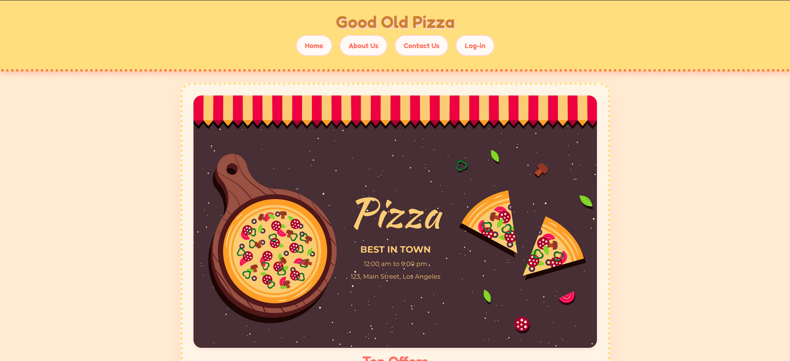

# 🍕 Good Old Pizza — Front Page System



Welcome to **Good Old Pizza**, a simple and modular front page system for pizzerias.  
This project is built using **HTML5**, **CSS3**, and **JavaScript** and aims to deliver a clean, responsive, and animated landing page that can serve as the starting point for more complex restaurant systems.


---

## 🚀 Features

- Responsive layout
- Modal login window with animation
- Top offers section with pizza images
- About Us and Contact Us informational sections
- Smooth in-page navigation using input buttons

---

## 🛠️ Technologies Used

- HTML5
- CSS3
- JavaScript

---

## 📁 Project Structure

```
pizza-system/
├── assets/
│   ├── css/
│   │   └── main.css
│   ├── js/
│   │   ├── mainpage.js
│   │   └── admscript.js
│   ├── images/
│   |   ├── banner.webp
│   |   ├── pepp.webp
│   |   ├── marg.webp
│   |   ├── bbqch.webp
│   |   └── veg.webp
│   └── fonts/
│       └── fredoka.woff2
├── index.html
├── admsystem.html
└── README.md
```

---

## 🖥️ How to Run the Project

1. Clone this repository:

```bash
git clone https://github.com/jggoncalez/pizza-system.git
```

2. Navigate into the project folder:

```bash
cd pizza-system
```

3. Open the `index.html` file in your browser:

```bash
# Windows
start index.html

# macOS
open index.html

# Linux
xdg-open index.html
```

## 🙋‍♂️ About the Author

Developed by [João Gabriel Gonçalez](https://github.com/jggoncalez).  
Feel free to contribute, open an issue, or fork the project.

---

## 📄 License

This project is licensed under the **MIT License**.  
You're free to use, modify, and distribute it — attribution is appreciated.

---
